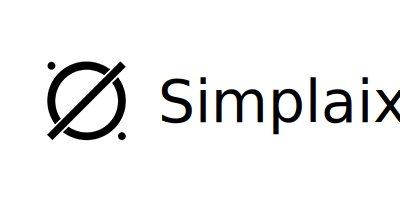
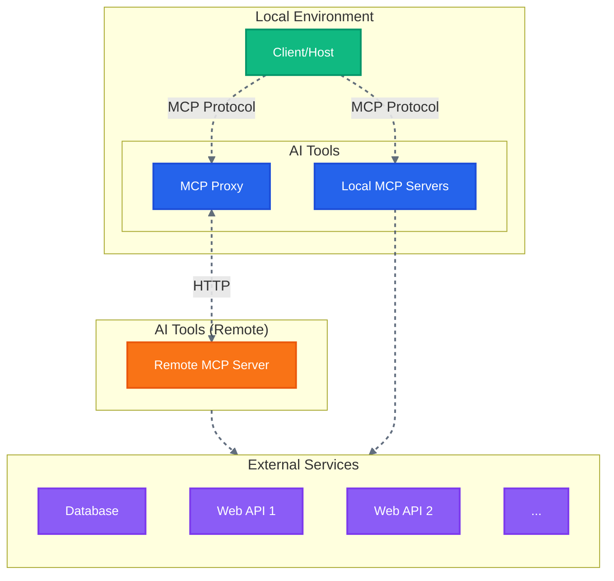

<p align="center">
  <picture>
    <source media="(prefers-color-scheme: dark)" srcset="images/simplaix_logo.svg">
    <source media="(prefers-color-scheme: light)" srcset="images/simplaix_logo.svg">
    
  </picture>
  <br/>
  <br/>
</p>

# Vision

Simplaix aims to revolutionize the way we interact with software tools by placing intelligent agents at the core of software design. By integrating software functionalities into agents and redesigning human-computer interactions, Simplaix aspires to liberate users from the role of software operators, enabling them to focus solely on decision-making.

# Overview

Modern software often requires users to navigate complex interfaces, perform repetitive tasks, and possess specialized knowledge to fully utilize its capabilities. Simplaix transforms this paradigm by:

1. **Agent-Centric Design:** Embedding software functionalities into intelligent agents that can understand natural language instructions, automate workflows, and provide actionable insights.

2. **Redesigned Interaction:** Shifting from manual operation to intuitive, conversational interactions, allowing users to delegate tasks to agents.

3. **User Empowerment:** Enabling users to focus on strategic decisions rather than operational details, fostering creativity and efficiency.

# Core Principles

- **Agent First:** Redesign software functionalities to prioritize agent-led operation in any scenario including temporary workflows.
- **Natural Interaction:** Facilitate communication with software using natural language, reducing the learning curve for new tools.
- **Integrity:** Design agents to enable seamless integration of diverse software systems, achieving complex workflows in a unified and efficient manner.
- **Decision-Driven Workflows & UI:** Redefine user experiences to emphasize strategic decision-making over operational tasks, fostering clarity and boosting productivity.

# Why not vision-based "Computer Use"?

A quick answer is that most UI components, such as buttons, are designed for human interaction. An AI Agent (computer program), however, doesn't need these visual elements to perform tasks or submit requests — it could interact directly with the underlying systems.

# Simplaix platform

The Simplaix platform is developed by [Simplaix](https://simplaix.com). The opensource version is developed based on the [Next.js AI Chatbot Template](https://github.com/vercel/ai-chatbot).

## Running locally

You will need to use the environment variables [defined in `.env.example`](.env.example) to run Simplaix. It's recommended you use [Vercel Environment Variables](https://vercel.com/docs/projects/environment-variables) for this, but a `.env` file is all that is necessary.

> Note: You should not commit your `.env` file or it will expose secrets that will allow others to control access to your various OpenAI and authentication provider accounts.

1. Install Vercel CLI: `npm i -g vercel`
2. Link local instance with Vercel and GitHub accounts (creates `.vercel` directory): `vercel link`
3. Download your environment variables: `vercel env pull`

```bash
pnpm install
pnpm dev
```

Your app application should now be running on [localhost:3000](http://localhost:3000/).


## Architecture



# Contributing

However you choose to contribute, please be mindful and respect our [code of conduct](CODE_OF_CONDUCT.md).

# License

Simplaix is open-source software licensed under the [Apache 2.0 License](https://github.com/simplaix/simplaix?tab=Apache-2.0-1-ov-file).